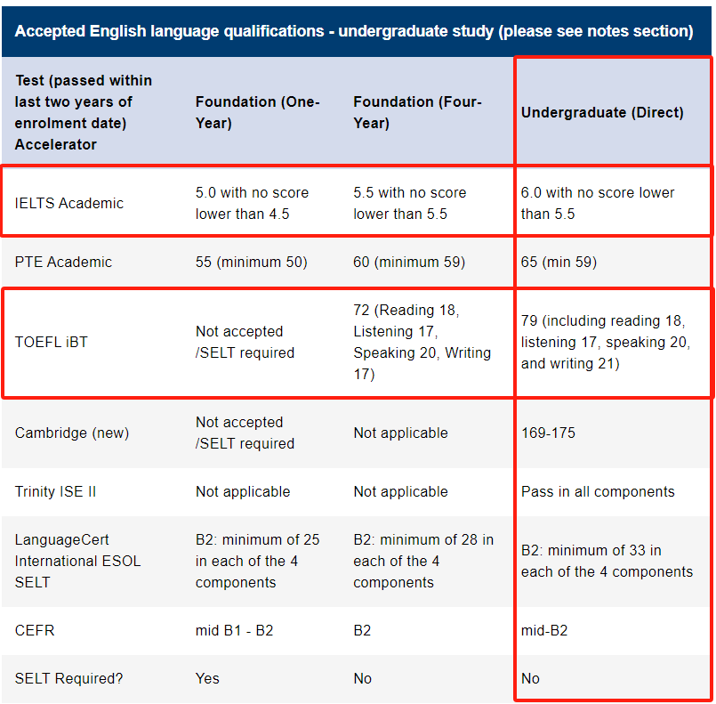

# OUC&HW 计科中外“宝宝”👶生存指南

## ⚠️注意

下一步准备开设更多关于OUC&HW计科中外的“专栏项目”例如：机器人学习规划，AI4S学习规划，申研规划等等

有兴趣参与其中的志同道合的朋友欢迎与我联系哈！！！（尤其20级的学姐/学长们哈）

邮箱email：个人：jzr071911@126.com  学校：zj2009@hw.ac.uk

## 前言

我是谁？为什么要写这个？

- 我是你们2021级某不知名也比较菜但很能讲很喜欢分享的学长
- 身为第二届的“小白鼠”希望自己的一些经验能让学弟学妹们少走弯路++

个人的一些social账号（MBTI：ENFJ）：

- 小红书：https://www.xiaohongshu.com/user/profile/642d82590000000010028a0a

  //当然如果有相关的“小问题”也欢迎👏在作者的小红书上私信咨询

  //比如“保研“和“出国”的一些大学长期规划和往届大致细节情况等等

- Github：https://github.com/zhaorui-bi 

  //长期寻找志同道合的合作伙伴 + 朋友 AI FOR LIFE SCEINCE

- 邮箱email：个人：jzr071911@126.com  学校：zj2009@hw.ac.uk

## 项目篇

 计算机科学与技术（中外合作办学）**双学籍注册** 

//恭喜你拥有了一个高贵的**英本**身份，国外申请buff拉满cool！

1. 中国海洋大学：Bachelor of Engineering in Computer Science and Technology
   - 微信公众号：中国海洋大学计算机学院 //其实主要都是计科中外的内容（毕业去向，学子访谈，课程跟踪）大家可往前翻翻看看
   - 中国海洋大学信息科学与工程学部官网：http://it.ouc.edu.cn/main.htm 
   - 注意：科研（进实验室）给老师写✍️email的时候记得根据学院官网找老师主页哈～
2. 赫瑞瓦特大学：Bachelor of Engineering in Robotics (F2R8-ROB) //链接是英方项目介绍
   - https://curriculum.hw.ac.uk/programmedetails/F2R8-ROB?termcode=202425
   - 赫瑞瓦特大学MACS学院CS部门的官网：https://www.hw.ac.uk/uk/schools/mathematical-computer-sciences/departments/computer-science.htm
   - 赫瑞瓦特大学CS学生信息官网：https://www.macs.hw.ac.uk/students/cs/

这样就以为着你拥有着来自于中方和英方的**成绩单**和**在读证明**

注意-1：保研（夏令营，预推免）和出国申请都可以开具 //体现英本身份

注意-2：不要”投机取巧“申请的时候只递交英方成绩单，招生办都明白，请大家递交中英双方成绩单

- 赫瑞瓦特大学成绩单开具链接：https://hwu.unidesk.ac.uk/tas/public/ssp/80768ff1-d4f4-44ee-acc6-f805472c0370 

  //下面图片是网站主页，点transcript那按照网站操作填表就好了

  

2024级计算机科学与技术（中外合作办学）宿舍情况：

- 大一：崂山校区 //一般情况下是四人间（中海苑是六人间但是很新）
- 大二 + 大三：西海岸校区 //独立卫浴 + 四人间
- 大四：赫瑞瓦特大学 (爱丁堡郊区) //traditional/modern 单人间

## 英语篇

Heriot-Watt University入学英语要求如下表（**第三列**）：（**总分**和**小分**都必须达标）

一般情况下建议大家考学术类雅思IELTS Academic //“学术英语”课讲是雅思相关的内容

如果有强烈的赴美深造的意愿也可以选择考托福TOFFL iBT一定一定要注意**小分要达标** 

Why英语这么这么重要重要？

- 赫瑞瓦特大学要求：达标雅思6（5.5）或者其他同等的语言成绩

  //不达标的话虽然有语言班，但是但是，特别特别贵，不值得

- 出国申请拥有非常亮眼的雅思或者是托福成绩是必备+加分项

- 无论是国内保研还是出国申请的面试都是“纯英文”的！！！

- 对于CS & AI 来讲最前沿的东西都是英文的比如：论文 + 课程

- 出国深造（大四&硕士&博士）沟通+学术交流都需要用English

## 课程篇

关于大一课程部分可以参考学长在**小红书**（链接在文档开头）写过的两篇帖子

- 《中国海洋大学计科中外新生之生存指南（一）》//其实上就是大一上
- 链接： http://xhslink.com/kayCyS
- 《中国海洋大学 中外计科 大一下 生存指南》
- 链接： http://xhslink.com/O4WCyS

编程启蒙+能力提升之推荐课程（编程语言是Python更加友好一些）

- UCB：CS61A: Structure and Interpretation of Computer Programs
- 链接：https://cs61a.org

一些实用的电子书网站（关于“科学上网”大家可以百度+“各显神通”）

- 搬书匠：http://www.banshujiang.cn/?lang=en
- vdoc.pub：https://vdoc.pub //需要“科学上网”

### 刷分问题

赫瑞瓦特大学成绩单（英方成绩单）：不支持刷分，即第一次考试的成绩分数为最终成绩单分数。

英方课程：https://curriculum.hw.ac.uk/programmedetails/F2R8-ROB?termcode=202425

注意：英方课程如果刷分，英方成绩单不更新，但是中方成绩单更新（中方成绩单刷分课程支持下面的原则）

中国海洋大学成绩单（中方成绩单）：支持刷分，同名课程取最高。

**刷分策略**：

- 尽量多去刷“高学分”课程
- 尽可能去刷“超低分”课程
- 多修高分“通识课”以抬高均分

注意：英方课所有课程学分都是一样的//“高数”和“数字逻辑”都是15学分在英方成绩单上

## 竞赛篇

可参考学长**小红书**（链接在文档开头）的《适合中国海洋大学中外计科宝宝的竞赛指南》

链接：http://xhslink.com/zSmDyS

- 总的来讲数学建模竞赛是所有人都可以参加且门槛较低的一个比赛
- 数学建模资料推荐：https://github.com/personqianduixue/Math_Model

Latex是数学建模等论文写作的必备语言，需要学会相应的软件配置

- 线上工具：Overleaf （不需要繁琐的配置，但是编译速度奇慢无比）
- macOS用户可参考自己GitHub给出的环境配置方案：https://github.com/zhaorui-bi/sublime-latex-macos
- windows用户可以参考链接：https://space.bilibili.com/11921722/channel/collectiondetail?sid=350752

CS能力提升可参考**CS自学指南**：https://csdiy.wiki  //PKU学长写的真心不错～

## 科研篇

总得来讲，科研这个东西主打一个“因人而异”！！！

- 海博党：非常重要！一定要有产出才可！建议早早开始！至少一篇顶会/刊！
- 保研党：“锦上添花” ！对于清北+华5档建议要有产出！建议早开始！
- 海硕党：“锦上添花” ！除非美国前20 + 英国牛剑！不然绩点为王！

备注：计科中外保研率根据2020级大概是百分之20左右

“工欲善其事，必先利其器” 完备科研工具是“必备品”🉑参考下面链接（一定复制“全”）

- 链接：https://ai4s.lab.westlake.edu.cn/blogs/2024/04/10/有用科研工具集锦.html

跑模型通常都是要在服务器上进行，故而一款优秀的服务器管理软件必不可少

- 暂时只推荐windows和macOS皆可的： FinalShell（国产款）和 Royal TSX（国外款）

必修模块 ML（2选1即可）和 DL模块（熟悉起来Pytorch深度学习框架），然后后面根据自己的兴趣点来选择后面三个板块的学习：CV（计算机视觉），NLP（自然语言处理），GNN（图深度学习）等等

### ML (Machine Learning)

- NTU：HUNG-YI LEE (李宏毅) MACHINE LEARNING
- 链接：https://speech.ee.ntu.edu.tw/~hylee/ml/2022-spring.php

- Stanford：CS229: Machine Learning
- 链接：https://cs229.stanford.edu/index.html-backup-fall23

### DL (Deep Learning)

- Pytorch 一小时快速入门
- 链接：https://pytorch.org/tutorials/beginner/introyt.html

- d2l 手动学深度学习 DIVE INTO DEEP LEARNING
- 链接：https://zh.d2l.ai

### CV (Computer Visison)

- Stanford：CS231n: Deep Learning for Computer Vision
- 链接：https://cs231n.stanford.edu

### NLP (Natural Language Processing)

- Stanford：CS224N: Natural Language Processing with Deep Learning
- 链接：https://web.stanford.edu/class/archive/cs/cs224n/cs224n.1234/

### GNN (Graph Neural Network)

- Stanford：CS224W: Machine Learning with Graphs
- 链接：https://snap.stanford.edu/class/cs224w-2023/index.html#content

更新时间：2024-08-09 贡献者：Zhaorui Jiang (Elijah)

结语：感谢在海大宝贵的三年！感谢一路上遇到的老师与伙伴！感谢自己所能经历的一切！愿项目今后越办越好！

## 专栏

### 机器人学习规划

链接：https://github.com/zhaorui-bi/OUC-HW-Survial-Guidance/blob/main/%E6%9C%BA%E5%99%A8%E4%BA%BA%E5%AD%A6%E4%B9%A0%E8%A7%84%E5%88%92.md

贡献者：

### 申研规划

链接：https://github.com/zhaorui-bi/OUC-HW-Survial-Guidance/blob/main/%E7%94%B3%E7%A0%94%E8%A7%84%E5%88%92.md

贡献者：

### AI4S学习规划 

链接：https://github.com/zhaorui-bi/OUC-HW-Survial-Guidance/blob/main/AI4S%E5%AD%A6%E4%B9%A0%E8%A7%84%E5%88%92.md

贡献者： 