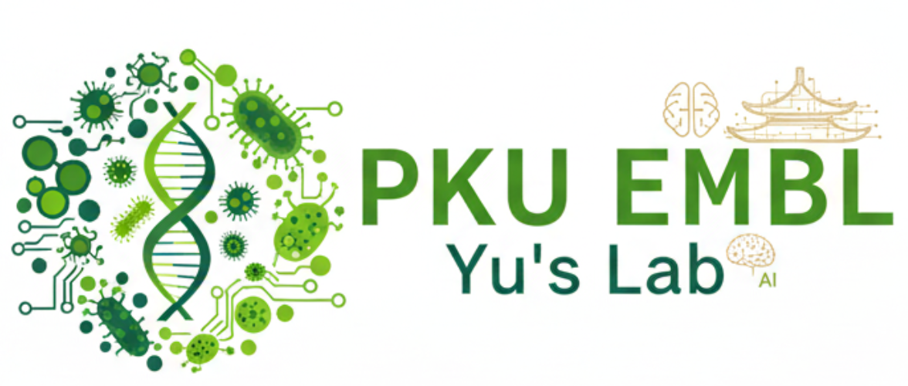

# Welcome to Data Visualization and Analysis Methods Course!

<!-- { align=right width=300 } -->

This repository contains the course materials for the Data Visualization and Analysis Methods (DVAM) course offered at Peking University. The course aims to equip students with essential skills in data visualization and analysis, enabling them to effectively interpret and present data insights.

## Contact

- Zhaorui(Elijah) JIANG ([zrjiang25@stu.pku.edu.cn](zrjiang25@stu.pku.edu.cn))

