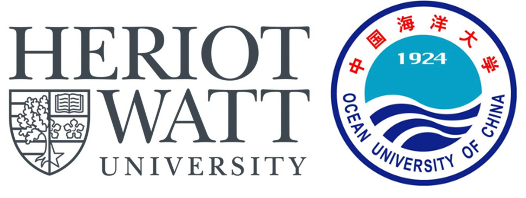
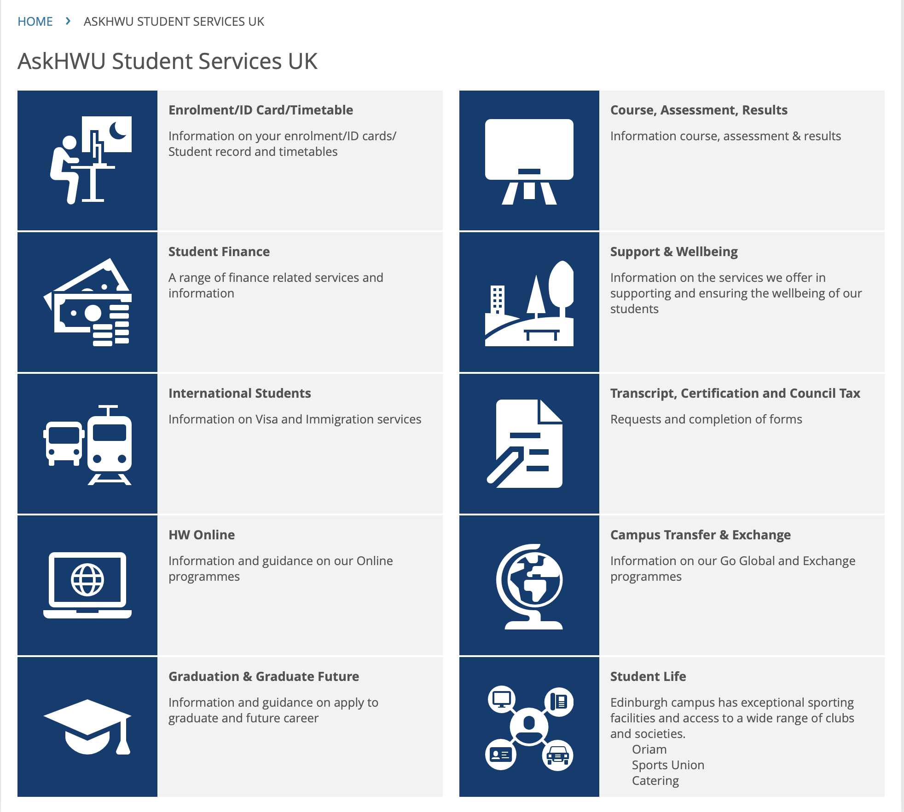
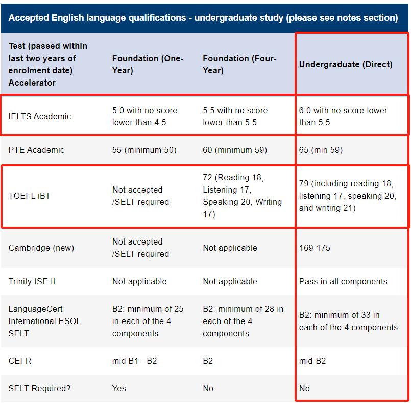
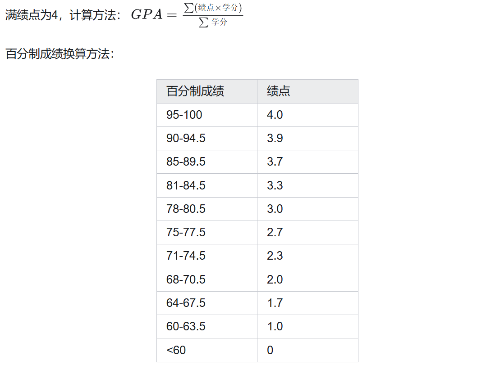

# OUC-HWU 计科中外学习与发展指南

<section class="guide-hero" markdown>
<div class="guide-hero__content" markdown>


<span class="guide-hero__eyebrow">Academic Knowledge Base</span>

<div class="guide-meta" markdown>
**OUC-HWU Computer Science Joint Programme**

Ocean University of China x Heriot-Watt University
</div>

本指南面向 OUC-HWU 计科中外合作办学项目学生，系统梳理培养规则、课程学习、语言要求、科研训练、升学申请、赴英准备与留学生活等关键议题。

<div class="guide-hero__actions" markdown>
[开始阅读](#路线图){ .md-button .md-button--primary }
[查看专题](#专题导航){ .md-button }
</div>
</div>

<div class="guide-hero__panel" markdown>
**文档状态**

- 内容基线：2026-02-09
- 站点更新：2026-07-02
- 维护者：Zhaorui(Elijah) Jiang
- 文档形态：非官方学生知识库
- 反馈方式：GitHub Issues / Pull Request
</div>
</section>

<div class="guide-stats" markdown>
<div markdown>
**11**

专题模块
</div>
<div markdown>
**OUC + HWU**

双学籍视角
</div>
<div markdown>
**2026**

持续维护
</div>
</div>

## 阅读说明

<div class="guide-grid" markdown>

<div class="guide-card" markdown>
### 信息边界

本文档以学生经验和公开资料为基础，不替代学校、学院、签证中心或目标院校的正式通知。
</div>

<div class="guide-card" markdown>
### 维护原则

涉及政策、申请要求、学校流程和外部链接时，建议保留来源、更新时间和适用届别。
</div>

<div class="guide-card" markdown>
### 使用方式

可将本指南作为检索入口和规划参考；做关键决策前，请回到官方页面进行二次确认。
</div>

<div class="guide-card" markdown>
### 贡献规范

欢迎通过 Issues 或 Pull Request 补充经验、修复链接和更新政策；请避免公开个人隐私或未授权材料。
</div>

</div>

## 核心内容 { #路线图 }

<div class="guide-grid" markdown>

<div class="guide-card" markdown>
### 项目基础

优先理解双学籍注册、成绩单体系、住宿安排、课程节奏与 GPA 规则，建立对项目结构的整体认识。

[进入项目篇](#项目篇)
</div>

<div class="guide-card" markdown>
### 语言要求

语言成绩、单项要求、赴英行前事项与落地流程需要提前确认；英语能力也应作为长期学术能力建设的一部分。

[进入英语篇](#英语篇)
</div>

<div class="guide-card" markdown>
### 科研训练

若目标涉及推免、博士申请或高竞争度院校申请，建议尽早规划科研训练、竞赛经历与方向探索。

[进入科研篇](#科研篇)
</div>

<div class="guide-card" markdown>
### 发展路径

推免、海外申请、科研入门、雅思备考、AI4Science 与机器人方向等内容已拆分为独立专题，便于按目标检索。

[查看专题](#专题导航)
</div>

</div>

## 阶段速查

| 阶段 | 推荐阅读 | 关键任务 |
| --- | --- | --- |
| 大一 / 大二 | [项目篇](#项目篇)、[课程篇](#课程篇) | 理解中英双方成绩单、课程节奏与基础 CS 能力建设 |
| 大三 | [科研篇](#科研篇)、[竞赛篇](#竞赛篇) | 明确推免 / 申请 / 就业方向，准备科研、竞赛或申请材料 |
| 准大四赴英 | [英语篇](#英语篇)、[行前准备](行前准备.md) | 确认语言成绩、住宿、行李、签证和落地事项 |
| 申请季 | [保研规划](保研规划.md)、[申研规划](申研规划.md)、[雅思备考](雅思备考.md) | 按时间线准备成绩、推荐信、文书、面试和语言成绩 |

## 专题导航 { #专题导航 }

<div class="topic-grid" markdown>

<div class="topic-card" markdown>
### [申研规划](申研规划.md)
海外硕博申请路线、材料准备和时间线。

贡献者：Chanel
</div>

<div class="topic-card" markdown>
### [保研规划](保研规划.md)
推免准备、规则理解和风险点。

贡献者：Zhaorui(Elijah) Jiang
</div>

<div class="topic-card" markdown>
### [机器人学习规划](机器人学习规划.md)
机器人方向学习路线与资源。

贡献者：Hongbo Li
</div>

<div class="topic-card" markdown>
### [AI4Science 学习规划](AI4Science学习规划.md)
AI for Science 入门、进阶和科研方向选择。

贡献者：Zhaorui(Elijah) Jiang
</div>

<div class="topic-card" markdown>
### [本科生如何做科研](本科生如何做科研.md)
本科生科研入门、文献阅读和课题切入。

贡献者：待补充
</div>

<div class="topic-card" markdown>
### [雅思备考](雅思备考.md)
IELTS 备考经验、资料和策略。

贡献者：Yu Zhou
</div>

<div class="topic-card" markdown>
### [行前准备](行前准备.md)
赴英行李、住宿、落地和生活事项。

贡献者：Zewen(Rex) Qu
</div>

<div class="topic-card" markdown>
### [留学生做饭菜谱](留学生做饭菜谱.md)
留学做饭、采购和生活经验。

贡献者：Hongbo Li
</div>

<div class="topic-card" markdown>
### [大学牲赚钱指南](大学牲赚钱指南.md)
大学阶段合规收入来源、技能变现和风险边界。

贡献者：待补充
</div>

<div class="topic-card" markdown>
### [Verilog 使用说明](Verilog代码/使用说明.md)
数字逻辑与 Verilog 小知识。

贡献者：Liangkun Chen
</div>

</div>

## 更新记录

| 模块 | 状态 | 致谢 |
| --- | --- | --- |
| Verilog 小知识 | 完成 | Liangkun Chen |
| 行前行李准备 | 完成 | Zewen(Rex) Qu |
| 申研规划 | 完成 | Chanel |
| 雅思备考 | 第一版完成 | Yu Zhou |
| 机器人学习规划 | 第一版完成 | Hongbo Li |
| AI4Science 学习规划 | 第一版完成 | Zhaorui(Elijah) Jiang |
| 本科生如何做科研 | 待完善 | 待补充 |
| 大学牲赚钱指南 | 待完善 | 待补充 |
| 留学生做饭菜谱 | 第一版完成 | Hongbo Li |

!!! note "关于这份指南"
    本文档保留部分个人经验叙述，同时会根据 GitHub Issues 的反馈持续补充专题。涉及政策、培养方案、申请要求和学校链接时，请以当年官方通知为准；引用或改编本文档时请遵守 CC BY-NC-SA 4.0 非商业共享协议。

---

## 编写说明

为什么整理这份文档？

- 本文档源于 2021 级学生在项目学习、科研与申请过程中的经验整理。
- 由于中外合作办学项目同时涉及中英两套培养与评价体系，系统化记录对后续年级具有参考价值。

个人 social 账号：

- 小红书：[个人主页](https://www.xiaohongshu.com/user/profile/642d82590000000010028a0a)
- GitHub：[zhaorui-bi](https://github.com/zhaorui-bi)
- Email：`jzr071911@126.com` / `zrjiang25@stu.pku.edu.cn`

本指南分为六个核心板块：[项目篇](#项目篇)、[英语篇](#英语篇)、[课程篇](#课程篇)、[竞赛篇](#竞赛篇)、[科研篇](#科研篇)、[专栏篇](#专栏篇)。

## 项目篇 { #项目篇 }

计算机科学与技术（中外合作办学）是双学籍注册项目。

!!! tip "项目特点"
    你会同时拥有中方和英方的成绩单 / 在读证明。保研、夏令营、预推免和海外申请时都可能用到，但申请时请如实递交中英双方材料。

1. 中国海洋大学：Bachelor of Engineering in Computer Science and Technology
   - 微信公众号：中国海洋大学计算机学院。毕业去向、学子访谈、课程跟踪等内容可以往前翻。
   - 信息科学与工程学部官网：[http://it.ouc.edu.cn/main.htm](http://it.ouc.edu.cn/main.htm)
   - 科研进组给老师写 email 时，建议先根据学院官网找到老师主页。
2. 赫瑞瓦特大学：Bachelor of Engineering in Robotics (F2R8-ROB)
   - 英方项目介绍：[课程页面](https://curriculum.hw.ac.uk/programmedetails/F2R8-ROB?termcode=202425)
   - MACS 学院 CS 部门官网：[Computer Science](https://www.hw.ac.uk/uk/schools/mathematical-computer-sciences/departments/computer-science.htm)
   - HWU CS 学生信息官网：[Student information](https://www.macs.hw.ac.uk/students/cs/)

赫瑞瓦特大学成绩单开具链接：[Student Service Portal](https://hwu.unidesk.ac.uk/tas/public/ssp/80768ff1-d4f4-44ee-acc6-f805472c0370)



2024 级计算机科学与技术（中外合作办学）宿舍情况：

- 大一：崂山校区。一般情况下是四人间，中海苑是六人间但很新。
- 大二 + 大三：西海岸校区。独立卫浴 + 四人间。
- 大四：赫瑞瓦特大学爱丁堡校区附近。traditional / modern 单人间。

## 英语篇 { #英语篇 }

Heriot-Watt University 入学英语要求如下表第三列，总分和小分都必须达标。



一般情况下建议考 IELTS Academic。学术英语课也会围绕雅思相关内容展开。如果有强烈赴美深造意愿，也可以选择 TOEFL iBT，但一定要注意小分要求。

为什么英语能力重要？

- 赫瑞瓦特大学要求达到 IELTS 6.0（各单项 5.5）或其他同等语言成绩。不达标虽然有语言班，但费用很高。
- 出国申请中，亮眼的雅思或托福成绩是必备项，也是加分项。
- 国内保研和出国申请面试都可能是英文面试。
- CS 和 AI 前沿内容主要以英文论文、课程和文档呈现。
- 大四、硕士、博士阶段的学习、沟通和学术交流都需要英语能力支撑。

## 课程篇 { #课程篇 }

关于计科中外课程，可参考既有系列文章。指南也会根据 GitHub Issues 的反馈继续补充专题，例如期末复习、课程选择和申请材料准备。

小红书链接：[个人主页](https://www.xiaohongshu.com/user/profile/642d82590000000010028a0a)

已有帖子包括：

- 中国海洋大学计科中外新生之生存指南（一）
- 中国海洋大学中外计科大一下生存指南
- 中国海洋大学中外计科大二上生存指南 1
- 中国海洋大学中外计科大二上生存指南 2
- 中国海洋大学中外计科大二下生存指南
- 中国海洋大学中外计科大三上生存指南
- 中国海洋大学中外计科大四上生存指南
- 中国海洋大学中外计科大四下生存指南

编程启蒙与能力提升推荐：

- UCB CS61A: Structure and Interpretation of Computer Programs
  [https://cs61a.org](https://cs61a.org)

实用电子书网站：

- 搬书匠：[http://www.banshujiang.cn/?lang=en](http://www.banshujiang.cn/?lang=en)
- vdoc.pub：[https://vdoc.pub](https://vdoc.pub)

### 中国海洋大学 GPA 计算规则



### 刷分问题

赫瑞瓦特大学成绩单（英方成绩单）不支持刷分，即第一次考试成绩为最终成绩单分数。

英方课程：[F2R8-ROB curriculum](https://curriculum.hw.ac.uk/programmedetails/F2R8-ROB?termcode=202425)

中国海洋大学成绩单（中方成绩单）支持刷分，同名课程取最高。也就是说，英方课程如果刷分，英方成绩单不更新，但中方成绩单会更新。

刷分策略：

- 尽量刷高学分课程。
- 尽可能刷超低分课程。
- 多修高分通识课以抬高均分。

!!! warning "保研特别注意"
    保研成绩计算通常只看第一次初修成绩，刷分对保研排名可能无效。具体以当年学院政策为准。

## 竞赛篇 { #竞赛篇 }

可参考小红书中的《适合中国海洋大学中外计科学生的竞赛指南》。

链接：[http://xhslink.com/zSmDyS](http://xhslink.com/zSmDyS)

- 数学建模竞赛是所有人都可以参加、门槛相对较低的比赛。
- 数学建模资料推荐：[Math_Model](https://github.com/personqianduixue/Math_Model)

LaTeX 是数学建模等论文写作的必备工具，需要学会相应软件配置：

- 线上工具：Overleaf。配置简单，但编译速度可能较慢。
- macOS 用户可参考：[sublime-latex-macos](https://github.com/zhaorui-bi/sublime-latex-macos)
- Windows 用户可参考：[Bilibili 配置教程](https://space.bilibili.com/11921722/channel/collectiondetail?sid=350752)

CS 能力提升可参考 [CS 自学指南](https://csdiy.wiki)。

## 科研篇 { #科研篇 }

科研训练具有较强的目标差异性，但越早理解其与升学目标之间的关系，越有利于形成稳定的长期规划。

| 目标 | 科研权重 | 建议 |
| --- | --- | --- |
| 海博 | 权重较高 | 建议尽早开始，并形成明确产出 |
| 保研 | 重要补充到关键加分 | 高竞争度院校建议具备科研产出 |
| 海硕 | 视目标学校而定 | 大多数情况下绩点仍是主线 |

备注：计科中外保研率根据 2020 级情况大概在 20% 左右。

必修模块 ML（2 选 1）和 DL 模块建议认真学，熟悉 PyTorch 深度学习框架。后续可以根据兴趣选择 CV、NLP、GNN、XAI 等方向。

!!! note "毕业设计提醒"
    前三年即使没有深入学习 AI / ML，大四毕业设计也大概率需要接触相关内容，建议提前建立基础。

HWU 毕业设计项目链接：[Project proposals](https://projects.hw.ac.uk/Proposals/Index)

### 科研工具

完备科研工具是长期学习和科研的基础：

- Missing Semester 中文版：[https://missing-semester-cn.github.io/](https://missing-semester-cn.github.io/)
- 有用科研工具集锦：[AI4S Lab Blog](https://ai4s.lab.westlake.edu.cn/blogs/2024/04/10/有用科研工具集锦.html)

跑模型通常需要服务器，一款好用的服务器管理软件会省很多时间。暂时推荐 Windows 和 macOS 都可用的 FinalShell 和 Royal TSX。

论文中的 LaTeX 公式编辑器：[https://arachnoid.com/latex/index.html](https://arachnoid.com/latex/index.html)

### Overall

MIT 6.S191 Introduction to Deep Learning
[https://introtodeeplearning.com/](https://introtodeeplearning.com/)

### ML

NTU Hung-yi Lee Machine Learning
[https://speech.ee.ntu.edu.tw/~hylee/ml/2022-spring.php](https://speech.ee.ntu.edu.tw/~hylee/ml/2022-spring.php)

Stanford CS229: Machine Learning
[https://cs229.stanford.edu/index.html-backup-fall23](https://cs229.stanford.edu/index.html-backup-fall23)

### DL

PyTorch 一小时快速入门
[https://pytorch.org/tutorials/beginner/introyt.html](https://pytorch.org/tutorials/beginner/introyt.html)

PyTorch 中文 API 文档
[https://pytorch-cn.readthedocs.io/zh/latest/](https://pytorch-cn.readthedocs.io/zh/latest/)

PyTorch 2024 快速入门（中文版）
[https://blog.csdn.net/ccaoshangfei/article/details/126074300](https://blog.csdn.net/ccaoshangfei/article/details/126074300)

d2l 动手学深度学习
[https://zh.d2l.ai](https://zh.d2l.ai)

### CV

Stanford CS231n: Deep Learning for Computer Vision
[https://cs231n.stanford.edu](https://cs231n.stanford.edu)

同济子豪兄 CS231n 计算机视觉课程
[https://www.bilibili.com/video/BV1K7411W7So](https://www.bilibili.com/video/BV1K7411W7So)

### NLP

Stanford CS224N: Natural Language Processing with Deep Learning
[https://web.stanford.edu/class/archive/cs/cs224n/cs224n.1234/](https://web.stanford.edu/class/archive/cs/cs224n/cs224n.1234/)

CS224n 笔记
[https://looperxx.github.io/notes/CS224n-2019-00-Info/](https://looperxx.github.io/notes/CS224n-2019-00-Info/)

### GNN

Stanford CS224W: Machine Learning with Graphs
[https://snap.stanford.edu/class/cs224w-2023/index.html#content](https://snap.stanford.edu/class/cs224w-2023/index.html#content)

同济子豪兄图机器学习公开课
[https://www.bilibili.com/video/BV1pR4y1S7GA](https://www.bilibili.com/video/BV1pR4y1S7GA)

课程主页
[https://github.com/TommyZihao/zihao_course/tree/main/CS224W](https://github.com/TommyZihao/zihao_course/tree/main/CS224W)

### XAI

同济子豪兄可解释机器学习公开课
[https://github.com/TommyZihao/zihao_course/tree/main/XAI](https://github.com/TommyZihao/zihao_course/tree/main/XAI)

### Computational Biology / AI for Life Science

MIT MLCB24 Machine Learning for Computational Biology
[https://canvas.mit.edu/courses/28242](https://canvas.mit.edu/courses/28242)

YouTube 视频列表
[https://www.youtube.com/watch?v=1zZSPeKGRzw&list=PLypiXJdtIca4gtioEPLIExlAKvu64z7rc](https://www.youtube.com/watch?v=1zZSPeKGRzw&list=PLypiXJdtIca4gtioEPLIExlAKvu64z7rc)

Guideline for Computational Biology and Bioinformatics
[https://github.com/gao-lab/Guideline-for-Computational-Biology-and-Bioinformatics](https://github.com/gao-lab/Guideline-for-Computational-Biology-and-Bioinformatics)

## 专栏篇 { #专栏篇 }

| 专栏 | 链接 | 贡献者 |
| --- | --- | --- |
| 申研规划 | [申研规划](申研规划.md) | Chanel |
| 保研规划 | [保研规划](保研规划.md) | Zhaorui(Elijah) Jiang |
| 机器人学习规划 | [机器人学习规划](机器人学习规划.md) | Hongbo Li |
| AI4Science 学习规划 | [AI4Science学习规划](AI4Science学习规划.md) | Zhaorui(Elijah) Jiang |
| 本科生如何做科研 | [本科生如何做科研](本科生如何做科研.md) | 待补充 |
| Verilog 小知识 | [使用说明](Verilog代码/使用说明.md) | Liangkun Chen |
| 雅思备考 | [雅思备考](雅思备考.md) | Yu Zhou |
| 行前行李准备 | [行前准备](行前准备.md) | Zewen(Rex) Qu |
| 大学牲赚钱指南 | [大学牲赚钱指南](大学牲赚钱指南.md) | 待补充 |
| 留学生做饭菜谱 | [留学生菜谱](留学生做饭菜谱.md) | Hongbo Li |
| 计算物理学 | [计算物理学](计算物理学.md) | 项目贡献者 |

## License

本项目采用 **CC BY-NC-SA 4.0** 协议，即署名、非商业、相同方式共享。

- 非商业使用：允许学习、教学、交流、引用和非商业转载。
- 署名要求：转载或改编时请保留项目名称、作者 / 贡献者信息和原始链接。
- 相同方式共享：改编内容应继续采用兼容的非商业共享协议。
- 商业用途：如课程售卖、商业培训、付费资料包或其他以商业收益为目的的使用，请先联系项目维护者。

完整协议说明见：[使用协议](usage-license.md)。

## Citation

如果本项目对你的学习或项目有帮助，欢迎引用：

```bibtex
@misc{OUC_Survival_Guidance,
  author       = {Jiang, Zhaorui and OUC-HWU Survival Guidance Team},
  title        = {OUC-HWU Survival Guidance: Ocean University of China and Heriot-Watt University Computer Science Joint Programme Guide},
  year         = {2024},
  publisher    = {GitHub},
  journal      = {GitHub repository},
  howpublished = {\url{https://github.com/zhaorui-bi/OUC-HW-Survial-Guidance}},
  note         = {Accessed: \today}
}
```
