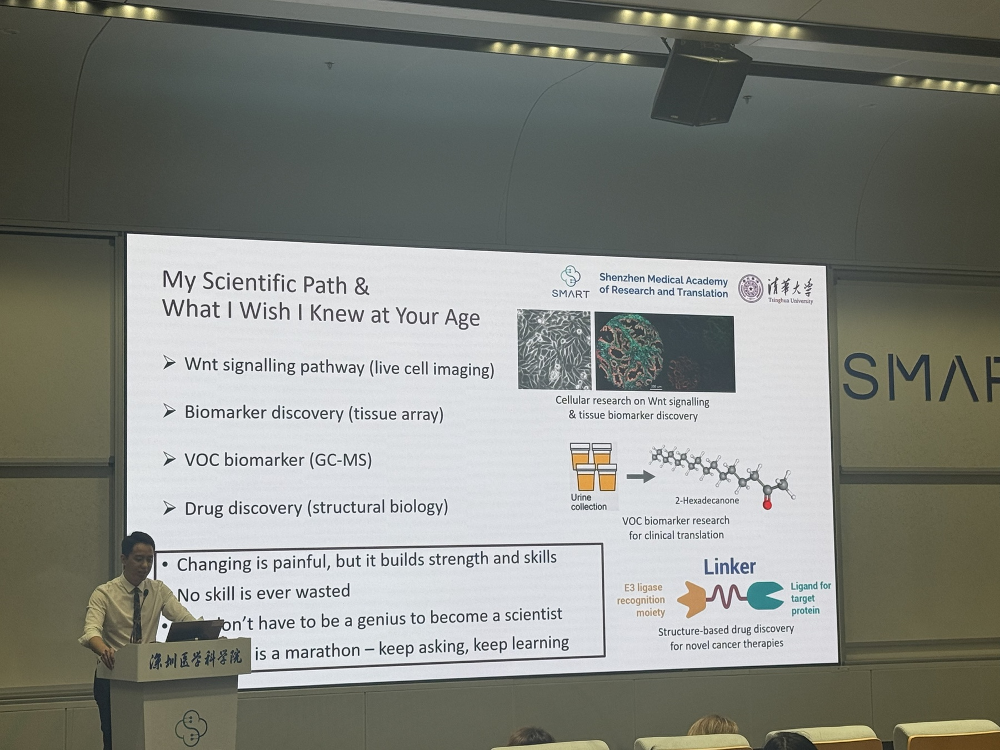

# 暑研与暑校申请

!!! info "写在前面"
    - 适用对象：想在本科阶段参加暑校、暑研或短期访学的同学
    - 更新时间：2026 年 8 月
    - 撰写：25级李金硕
    - 本文主要来自我大一暑假的申请和参与经历。各项目要求每年都会变化，具体信息请以主办方官网和学校通知为准。

大一暑假，我参加了北京大学定量生物学暑期班（PKU CQB），之后又来到 SMART-SZBL 参加了官方暑研。这两段经历经常被一起提到，但实际感受很不一样。

北大的暑期班只有三天，课程很密集。对当时没有系统学过生物的我来说，很多内容都很陌生，但它让我在很短的时间里看到了定量生物学、合成生物学和柔性机器人等不同方向，也让我开始思考，自己在计算机和机器人学中学到的方法还能用在哪里。

SMART-SZBL 的节奏则更接近日常科研。我需要跟着组里的安排学习和工作，补背景、熟悉工具，并开始接触分子动力学。相比听几天课，这种经历更容易让人发现：自己是不是真的愿意在一个问题上继续花时间。

所以下面并不是一套“标准答案”，只是我这一轮申请后觉得比较有用的做法，希望可以给大家提供一些思路。

## 先分清暑校和暑研

**暑校**通常以课程、讲座、工作坊和参访为主，有时也会安排小组项目。对我来说，它最大的价值是到不同学校或城市体验学习，快速了解一个陌生方向，同时认识优秀的同学，并获得和老师线下交流的机会。

**暑研**通常是进入课题组，围绕一个具体问题学习和工作。它更接近科研的日常，可以训练阅读、编程、实验、沟通和汇报。如果最终形成了长期、实质的合作，也更有机会获得基于具体工作的推荐信。

暑校并不是暑研的“低配版”。如果暂时还不清楚方向，先参加暑校，看看一个领域里的人在研究什么，是很自然的开始。想进一步判断自己是否适合科研，或者计划申请研究型硕士、PhD，再争取一段投入时间更长的暑研会更有帮助。无论是想做出实际工作，还是希望以后能和导师保持联系，前提都是先把这段暑研认真做下来。

## 我是怎么找机会的

我看到的项目信息，一部分来自 Google 和小红书，另一部分来自学长学姐的分享。寻找时没有必要只盯着一个地区，可以同时看中国大陆、香港、新加坡、北美和欧洲，但要先确认项目是否接受自己的年级、国籍和专业背景。（尤其是能卡得上咱们专业时间线的真的很少）

一般有两种找法：

1. 申请学校或研究机构统一组织的项目。在官网搜索 `summer school`、`undergraduate summer research`、`research internship`、`visiting student` 等关键词。
2. 找到自己感兴趣的 PI，阅读课题组主页和近期论文，再发邮件询问是否有本科生参与的机会。

我建议简单建一张表，记下项目名称、方向、官网、截止日期、申请材料、资助、时间和当前进度。不然看过的项目多了，很容易忘记在哪里看到、什么时候截止。

选项目时，我现在更关注三件事：研究问题是否真的感兴趣，有没有人负责日常指导，以及时间上能不能认真投入。学校和项目的 title 当然重要，但如果进去以后没有明确工作，只是短暂停留，实际收获可能并没有想象中那么大。

## CV、邮件和个人网站

大多数申请都离不开 CV，有些项目还会要求类似个人陈述的材料。低年级经历不多很正常，与其把内容写得很满，不如把两三个最相关的项目说清楚：项目要解决什么问题，自己负责什么，用了什么方法，现在做到什么程度。

给 PI 发邮件时，正文不需要很长。简单介绍自己的学校和年级，说明为什么对老师的研究感兴趣，挑一段最相关的经历，再写清楚希望参与的时间和形式就可以。可以广泛联系，但不要把同一封邮件原样群发；至少要让对方看出，你确实读过课题组的研究介绍。

附件通常放 PDF 版 CV，邮件里可以附个人网站、GitHub 或代表项目。我也比较建议尽早做一个个人网站。它不需要很复杂，能放下个人简介、项目、代码或报告、CV 和联系方式就已经够用。对我来说，做网站还有一个额外作用：它会逼着自己重新检查，哪些事情是我真正做过的，哪些内容又能拿出证据。

网站并不是申请的硬门槛。如果暂时没有，也可以先整理一个干净的 GitHub、项目报告或作品集。重点不是形式有多漂亮，而是老师点开以后能继续了解你的工作。

## 面试前准备一份自己的 PPT

有些项目在看过 CV 和邮件后会安排面试。这时最好提前准备一份 5—8 分钟的 PPT，不要等老师临时要求才开始整理。

我比较推荐下面这个顺序：

1. 一页自我介绍：学校、专业和目前感兴趣的方向；
2. 一页相关课程和技能，只放与这次申请有关的内容；
3. 用两三页讲 1—2 个代表项目：问题、个人工作、方法、结果或当前状态；
4. 一页说明为什么想加入这个课题组，以及自己能参与的时间；
5. 最后一页准备几个希望向老师了解的问题。

老师很可能会追问项目细节，所以不要只放最终效果图。为什么这样做、遇到过什么问题、怎样排查、如果继续做会怎么改，这些往往比列一串技术名词更重要。没有正式科研经历时，课程项目、复现工作和个人项目也可以讲，只要如实说明它们的性质。

除了 PPT，也可以提前整理好 GitHub、Demo、技术报告、海报或论文阅读笔记。涉及课题组内部数据、代码和未公开稿件时，一定先确认是否允许展示。

!!! tip "我在面试里栽过的跟头"
    材料和 PPT 中出现过的每一个字都要尽量吃透。对自己的工作不熟悉，在老师看来会是很大的扣分项；哪怕只是某个指标具体怎么算，也有可能被一直追问。我自己就在这里栽过跟头。

## 时间和形式可以商量，但安全不能省

暑研不一定只有“整个暑假线下全职”一种形式。正式开始前，可以和老师沟通起止日期、每周投入、线下或远程安排、日常指导人和第一阶段任务。如果与课程、考试或其他安排冲突，也可以如实说明，再讨论是否调整时间或形式。

最好同时问清楚工作内容、需要使用的数据和设备、预期交付物，以及代码、署名、保密和成果公开的边界。这不是显得麻烦，而是避免双方开始以后才发现理解完全不同。

!!! warning "一定要注意安全"
    - 通过大学、研究机构和课题组官网核验项目、PI 与联系人身份。对要求向个人账户缴费，或承诺“保论文、保推荐信”的机会保持警惕。
    - 护照、身份证、银行信息、住址等材料，只在确认正式流程确有需要后，通过主办方指定渠道提交。
    - 线下参加前确认住宿、交通、保险、紧急联系人和实验室安全培训。涉及实验操作时，不要在没有培训和指导的情况下独立进行。
    - 不要把课题组内部数据、代码、聊天记录或未公开结果直接放到个人网站和 GitHub。
    - 如果工作内容、地点或沟通方式让自己感到不安全，及时暂停，并向家人、学校老师或可信任的项目负责人求助。

## 把它当成一场长距离跑步

在 SMART 的一场讲座里，我拍下了这页 PPT。最后一句是：**“Science is a marathon — keep asking, keep learning.”**

{ .guide-image .guide-image--wide }

*SMART 讲座现场：Science is a marathon — keep asking, keep learning.*

我对它的理解不是“只要坚持就一定会成功”，而是不必因为一次申请、一次拒绝，或者一个阶段没有结果，就急着判断自己行不行。方向可以换，参与形式可以和老师商量，跑得慢一点也没有关系。

暑研和暑校都只是其中的一段。我现在能做的，无非是继续问、继续学，找到自己的节奏，然后尽量不要停下来。
