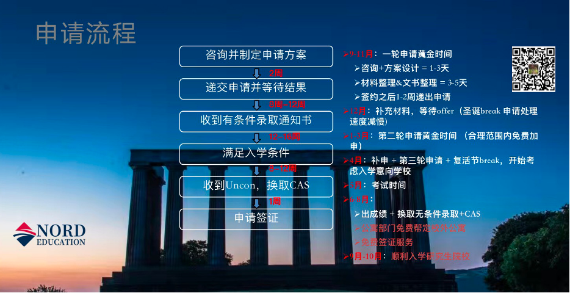

# 申研规划

中外计科的同学们，大三该做什么？

Nord Education爱丁堡- Chanel Yang

## 学术准备

### 提高学术成绩

确保在本科阶段保持较高的综合均分，可以进行有必要的刷分，英国大学对于研究生申请者的本科成绩要求较高。如果想要申请帝国理工等级的院校，建议前三年均分最好在85+。

基本原则：低于70分的且学分在3分以上的重点重修，数学等基础课比较重要，如果专业课相关的比较低的、觉得重修把握不大就不建议浪费时间和精力了，把更多的精力放到所有大三课程的学习和备考中去，把大三所有课程学好考好才是重中之重。

### 语言准备

提前准备并参加雅思考试，通常需要达到6.5-7.0分，部分专业可能要求更高的分数。

### 加分项目准备

了解与备考GRE考试

## 实习和科研经历

### 寻找实习机会

利用暑期或课余时间进行相关领域的实习，提高自己的实践经验。如果需要相关资源可以帮忙提供。

### 参与科研项目

可以联系本校的教授，参与他们的科研项目，提升自己的科研能力，并为将来的研究生申请积累经验。如果需要相关资源可以帮忙提供。

## 时间表

### 大二结束暑假

- 参与合适的实习
- 开始了解GRE考试，确认自己是否能够有信心攻克。GRE有竞争力的分数是330+
- 寻找合适的科研机会

### 大三上学期

- 专注于学术成绩，包括之前的刷分以及大三的正式课程的分数都要注意
- 寻找进组机会

### 大三上结束寒假

- 学习GRE/ 学习雅思（如果觉得可以考GRE这个时间开始正式的学习和刷分，如果太难就及时放弃，开始主攻雅思的学习和刷分）

### 大三下学期

- 雅思刷分
- 5月开始准备申请材料，完成推荐信和个人简历
- 6-7月出成绩确定申请的学校和专业，正式开始准备文书材料
- 9月份进入正式申请递交环节

### 2024年12月开始具体时间线与准备规划如下：

| 月份 | 主题                         | 形式                                                         |
| ---- | ---------------------------- | ------------------------------------------------------------ |
| 11月 | 签约、定制初步申请目标和意向 | 1.面谈微信沟通，建立初步申请专业及院校意向                   |
| 12月 | 考试时间、出成绩时间         | 1.微信沟通，记录学生考试时间、放假时间以及出成绩时间 2.对于即将迎来的考试给予鼓励，并提醒勿忘目标 |
| 1月  | 实习筛选和选择               | 1.微信沟通，询问是否有相关实习机会，协助学生选择合适的实习项目、或鼓励学生去找哪种合适的实习 |
| 3月  | 实习、实习证明               | 1.邮件（邮件中表达实习也是很重要的，并在附件中附上实习证明模板，要求学生回复邮件是否预计参加实习，是否准备好实习证明，并提供实习证明proofreading) 2.微信告知该邮件，并要求学生回复 |
| 4月  | CV指导                       | 1.邮件(提供CV模板，介绍CV应该具备的内容） 2.微信告知该邮件，并要求学生尽快准备CV,并回复 |
| 5月  | 准备推荐信                   | 1.邮件（介绍推荐信需要准备的内容） 2.微信告知该邮件，并要求学生尽快准备推荐信 |
| 6月  | 考试时间、出成绩时间         | 1.邮件（以问卷形式询问考试时间、预计大三结束均分等信息） 2.微信告知学生，并要求学生填写问卷 |
| 7月  | PS、成绩单                   | 1.邮件(PS常见问题管疑，发送PS问卷为附件) 2.微信告知学生，并要求填写推荐信问卷，开始准备PS |
| 8月  | PS、成绩单                   | 1.邮件（PS常见问题答疑，发送PS问卷为附件；若已经准备完PS的学生，则开始跟进其他材料，每隔两周发送未备齐材料清单，每隔一周微信提醒还缺材料） 2.微信告知学生，并要求填写推荐信问卷，开始准备PS；微信提醒学生还缺哪些材料 |
| 9月  | 催剩余材料                   | 重复上个月的步骤                                             |
| 10月 | 确认是否递交，没递交的催材料 | 邮件+微信                                                    |

### 2025年9月进入正式递交申请的阶段时间线如下：

### 大四上学期

- 提交申请材料，等待录取结果
- 参加面试（如果需要）

### 大四下学期

- 进行合理补申请，等待录取结果
- 拿到毕业证和成绩单，以及合格的雅思成绩，换取最终录取通知
- 申请签证并准备出国。

## 申请材料准备

关于申请材料：

1. 护照照片页+CAS 确认信+visa签证页+brp正反面
2. 国内大学成绩单（中英文）+英国成绩单
3. 根据要求提供PS问卷
4. 两封推荐信信息采集表，或提供两位推荐老师的信息（请填写推荐人姓名、职位、教授课程、学院、联系电话、办公地址）
5. 双学位提供：中方成绩单+在读证明（中英文）+英方成绩单+英方在读证明；
6. 授权信：打印，英文填写，中英文签字。（中文签字必须与护照一致）
7. 个人简历（optional）
8. 提供留学申请专用邮箱并完成设置转发(具体操作指南请参考邮件附件)

## 选择学校和专业

- 调查学校和专业
- 根据自己的兴趣和职业规划选择适合的学校和专业，了解每个学校的具体要求和所需分数，给自己制定合理目标。

## 资金准备

- 了解学费和生活费用
- 提前了解英国各个大学的学费和生活费用，并开始规划资金准备。

## 其他建议
   
- 多和已经在英国留学的学长学姐交流，获取第一手的信息和建议
- 辩证看待所有小红书及网络信息，辨别特例进行营销的手段，减轻自己的焦虑与负担，身心健康才是我们第一重要的事情哟！
